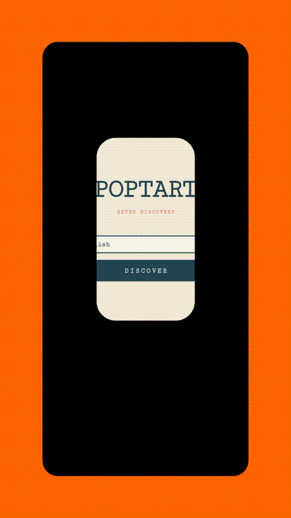

   
  

  <h1 style="border-bottom: none; margin-top: 10px;">PopTart</h1>

  **Escape the Mainstream. Discover the Underrated.**

  *A high-performance Flutter client leveraging the Last.fm API to surface hidden musical gems.*

  
  
  

  [**🚀 Download Latest APK**](https://github.com/ajy-ocean/poptart/releases/latest)

---

### ⚡ Why PopTart?

PopTart is designed to stay out of your way. No accounts, no complicated menus—just discovery.

- **Open & Explore:** Launch the app to see a curated feed of artists making waves in the underground scene.
- **Skip the Noise:** Smart filtering hides "Top 40" hits, ensuring every artist you see is a true discovery.
- **Deep Dive:** Access detailed artist biographies and metadata directly through the Last.fm engine.

### 📸 Preview

  
   
  <em>See PopTart in action: Filtering the noise and finding the gems.</em>

Created by R^W^TJI | Licensed under MIT
